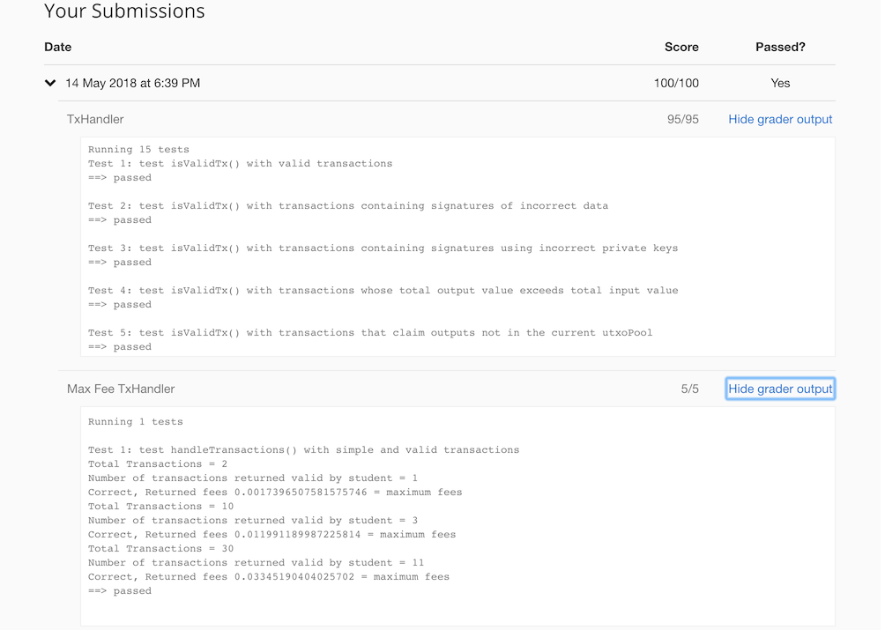

Assignment 1: ScroogeCoin
=============================

In `ScroogeCoin`, the central authority Scrooge receives transactions from users. 

Scrooge organizes transactions into time periods or blocks. In each block, 

  * Scrooge will receive a list of transactions
  * Validate the transactions he receives
  * Publish a list of validated transactions
  
Poits to remember:

  * A transaction can reference another in the same block. 
  * Among the transactions received by Scrooge in a single block, more than 
  one transaction may spend the same output. This is `double-spend` and hence 
  invalid. 
  * Transactions can’t be validated in isolation; it is a tricky problem to 
  choose a subset of transactions th​at are ​together valid.

### Transaction Class
It represents a ScroogeCoin transaction and has inner classes ​`Transaction.Output​` 
and ​`Transaction.Input​`. A transaction consists of a **list of inputs**, 
a **list of outputs** and a **unique ID**. 

A **transaction output** consists of a value and a **public key** to which it is 
being paid. 

A **transaction input** consists of the hash of the transaction that contains 
the corresponding output, the index of this output in that transaction 
(indices are simply integers starting from 0), and a digital signature. 

For the input to be valid, the signature it contains must be a valid signature 
over the current transaction with the public key in the spent output. The
raw data, which is to be signed, is obtained from the 
`​getRawDataToSign`​ method.

### Crypto Class
To verify a signature, the ​`verifySignature` method of `Crypto` class is used.

### UTXO Class
A `​UTXO​` class represents an **unspent transaction output**. A ​UTXO contains 
the hash of the transaction from which it originates as well as its index 
within that transaction. 

### UTXOPool Class
The  `UTXOPool`​ class represents the current set of outstanding UTXO​s and 
contains a map from each ​UTXO​ to its corresponding transaction output.

### TxHandler Class
The `TxHandler` class  does the following:

  * Validates a transaction by checking:
    1. All outputs claimed by a transaction are in the current UTXO pool.
    1. The signatures on each input of transaction are valid.
    1. No UTXO is claimed multiple times by the transaction.
    1. All of transaction's output values are non-negative. 
    1. The sum of transaction's input values is greater than or equal to the 
    sum of its output values.
    
  * Processes an unordered array of proposed transactions. Checking each 
  transaction for correctness and returns a mutually valid array of accepted 
  transactions. Updates the current UTXO pool as appropriate.

### MaxFeeTxHandler Class (Extra Credit)
The `​MaxFeeTxHandler`​ class  finds a set of transactions with the maximum 
total transaction fees, i.e., maximize the sum over all transactions in the 
set of provided transactions.

## Result
