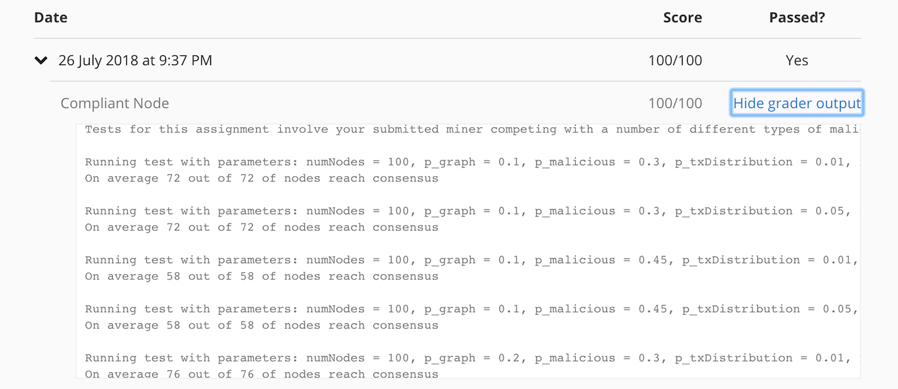

Assignment 2: Consensus of Trust
===================================

The requirements for this assignment is to design a **distributed consensus algorithm** given a graph of 
“trust” relationships between nodes. The network is a directed random graph, where each edge represents a 
trust relationship. A node in the graph can either be `compliant` or `malicious`. 

In a directed graph, an `A → B` edge means that Node `B` listens to transactions broadcast by node `A`. 
The node `B` is termed `A’s` follower while node `A` is `B's` followee.

## Objective
Each node will receive different sets of transactions at the beginning. The objective of each node is to achieve a 
consensus with its peers in the network by agreeing on a common set of transactions after a set of rounds. 
At the end of each round, a node will broadcast to its follower a proposal consisting of transactions. 

Each node will be given its list of followees via a boolean array whose indices correspond to nodes in the graph. 
A `true` at index `i` indicates that the node `i` is a followee, `false` otherwise. 

## Assumptions

- All transactions are valid and that invalid transactions cannot be created.

- A nodes should be able to withstand as many malicious nodes as possible and still achieve consensus. 

- Malicious nodes may have arbitrary behavior. A malicious node might be:
  - be functionally dead and never actually broadcast any transactions.
  - be constantly broadcasts its own set of transactions and never accept any transaction given to it.
  - change behavior between rounds to avoid detection.
  
## List of Classes

|  Class              | Function                                                                                            |
|---------------------|-----------------------------------------------------------------------------------------------------|
| `Node.java`         | A basic interface for `CompliantNode` class                                                         | 
| `CompliantNode.java`| An implementation of compliant node. The assignment is to implement this class.                     |
| `Candidate.java`    | A simple class to describe a candidate transaction which a node receives.                           | 
| `MaliciousNode.java`| A very simple example of a malicious node.                                                          |
| `Simulation.java`   | A basic graph generator to run simulations with varying graph parameters.                           |
| `Transaction.java`  | A transaction with a unique identifier. Transaction validation is not required for this assignment. |

## Proposed Solutions

### Solution 1: Blacklisting followee 
**Score:** 90/100

**Example:** CompliantNode1.java

1. A node blacklists a followee if it fails to send a transaction.
1. Once a followee is blacklisted, it remains blacklisted for the current and all the future rounds.
1. Only considers transactions from a non-blacklisted followee.

### Solution 2: Blacklisting followee with a check for transactions from the preceding round
**Score:** 93/100

**Example:** CompliantNode27.java

It's solution 1 with a slight variation.

1. A node blacklists a followee if it fails to send a transaction.
1. Once a followee is blacklisted, it remains blacklisted for the current and all the future rounds.
1. Keeps a history of transactions sent by a followee in the previous round.
1. In the current round, only consider transactions from a non-blacklisted followee if the current set of transactions 
sent by the followee is a super set of transactions from the previous round(by the same followee).

### Solution 3: Blacklisting followee with a check for transactions meeting a threshold
**Score:** 97/100

**Example:** CompliantNode37.java

1. A node blacklists a followee if it fails to send a transaction.
1. Once a followee is blacklisted, it remains blacklisted for the current and all the future rounds.
1. For all rounds except the last 2 rounds, consider all transaction sent by all non-blacklisted followees.
1. In the last 2 rounds, keep track of number of times a transaction has been sent by all the non-blacklisted followees. 
1. Consider only those transactions where the transaction count meets a certain threshold.

| Score    | Threshol                                                                            |
|----------|-------------------------------------------------------------------------------------|
| 96/100   | if txn count > threshold (0.2 * number of followees) for the last 1 round           |
| 97/100   | if txn count > threshold (0.2 * number of followees) for the last 2 rounds          |
| 97/100   | if txn count >= threshold (0.2 * number of followees) for the last 2 rounds         |
| 97/100   | if txn count >= threshold (0.2 * number of followees) for the last 2 rounds         |
| 97/100   | if txn count > threshold (malicious * number of followees) for the last 1 round     |
| 95/100   | if txn count > threshold (number of followees - 1)/ 5 for the last 2 rounds         |
| 95/100   | if txn count >= threshold (number of followees - 1)/ 5 for the last 2 rounds        |
| 95/100   | if txn count > threshold (0.3 * number of followees) for the last 2 rounds          |

### Solution 4: Secret Handshake
**Score:** 100/100

**Example:** CompliantNode.java

This solution is completely different from all the previous solutions. Here, all the compliant nodes follow
a secret protocol to establish trust between each other. The secret protocol can be thought of as a secret handshake.

Here is the simple protocol for establishing trust:

1. A node only sends a fix number of transaction for the first few round. These rounds are here by termed as trusted rounds.
1. In this example, the number of trusted round is set at 2 while the fix number of transactions is set at 1.
1. For the first 2 rounds, a node sends only 1 transaction from its initial pending transaction set.
1. Each node keep tracks of every followee who has sent 1 transaction in the first 2 rounds. A node maintain a
folowee score card. Every time a followee meets the previous criteria, the followee score count is incremented.
1. From the 3rd round onward, a node only considers those folowees who have a score of 2. 
1. For the 3rd round, a node sends all the transactions from all the followees with a score of 2 plus the 
intial set of pending transactions.
1. For the remaining rounds, only the transactions from the followees with a score of 2 are considered.

## Submission Result

