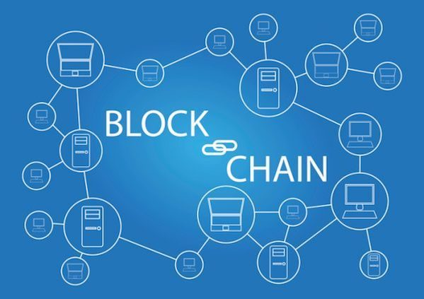
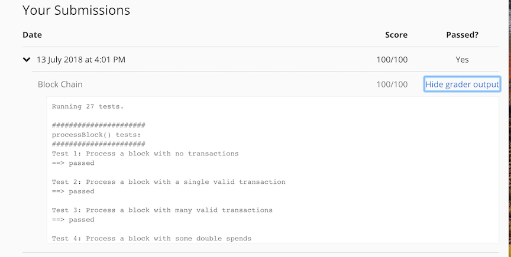

Assignment 3: Blockchain
===================================

The requirements of `BlockChain` assignment is to implement a node that’s part of a block-chain-based distributed 
consensus protocol. The block chain maintains an updated chain as it receives incoming transactions and blocks.

Points to remember:
  * A new genesis block won’t be mined. If a genesis block (parent is a null hash) is received `​addBlock` method, 
  the block is not added to the chain.
  
  * If there are multiple blocks at the same height, the oldest block in `getMaxHeightBlock`​ ​function.
  
  * Unlike actual Bitcoin, a coinbase transaction of a block is available to be spent in the next block mined on top of it.

  * A global transaction pool is maintained for the whole block chain.
  
  * The coinbase value is kept constant at 25 bitcoins. For Bitcoin, it halves roughly every 4 years and it's currently 
  at 12.5 BTC.
  
  * When checking for validity of a newly received block, only transactions are checked for validity. 
    The set need not be a maximum possible set of transactions. 
  
  * No proof-of-work check is needed.

## List of Classes:

### Block
Stores the block data structure.

### BlockHandler
Uses `​BlockChain` to process a newly received block, create a new block, or process a newly received transaction.

### ByteArrayWrapper
A utility class which creates a wrapper for byte arrays which can be used as a key in hash functions.

### Transaction
This class is similar to `Transaction` in `ScroogeCoin`assignment  except it creates an additional `coinbase` transaction. 

### TransactionPool
It represents a a pool of transactions and it's required while creating a new block.

### UTXO
Similar to `UTXO` class in `ScroogeCoin` assignment. It represents an **unspent transaction output**. 
An UTXO contains the hash of the transaction from which it originates and as well as the index within that transaction. 

### UTXOPool
Similar to `UTXOPool` class in `ScroogeCoin` assignment. The  `UTXOPool` class represents the current set of 
outstanding UTXOs and contains a map from each UTXO to its corresponding transaction output.

## Submission Result
